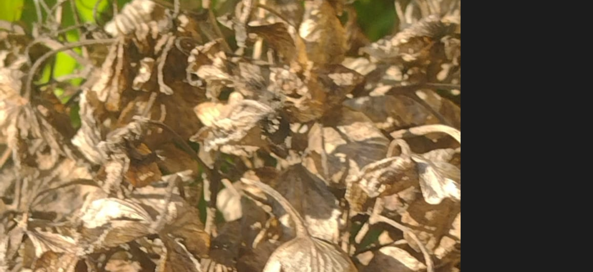
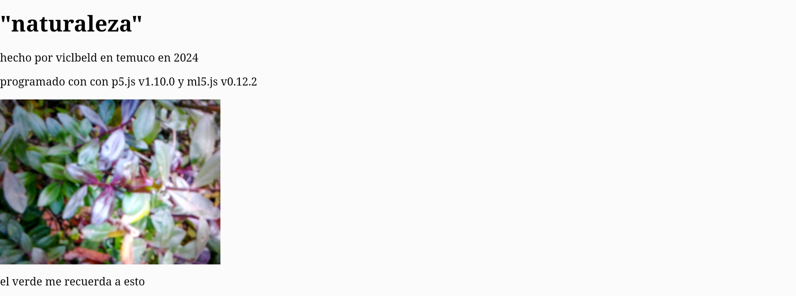
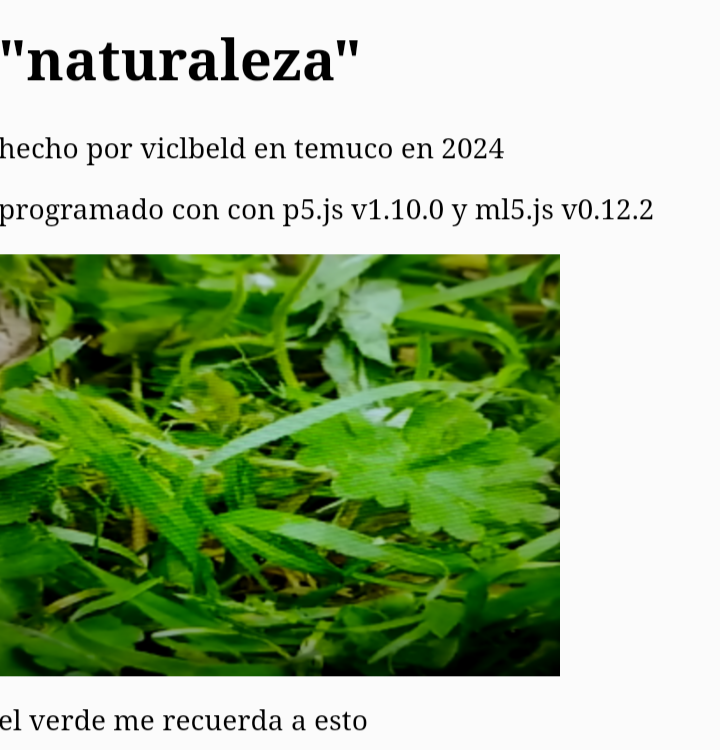
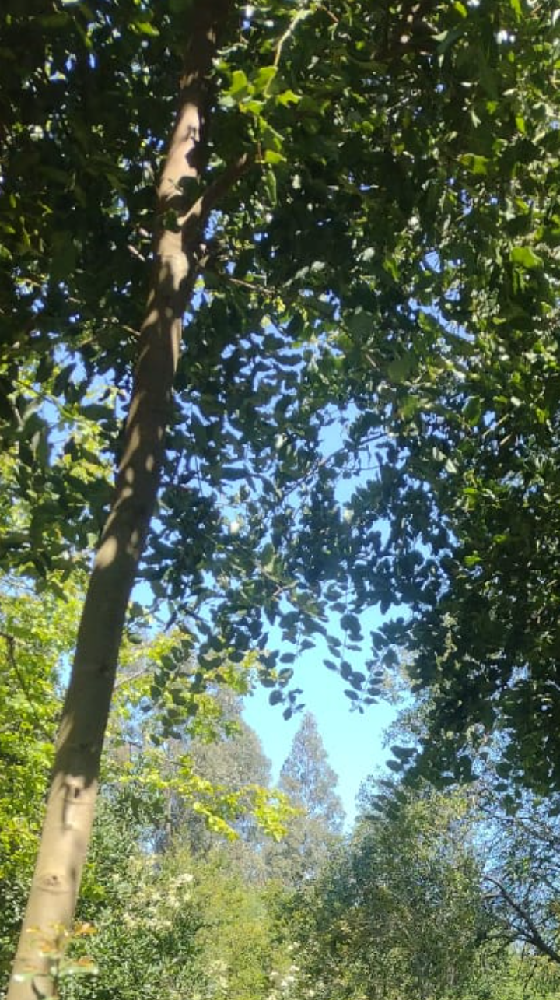
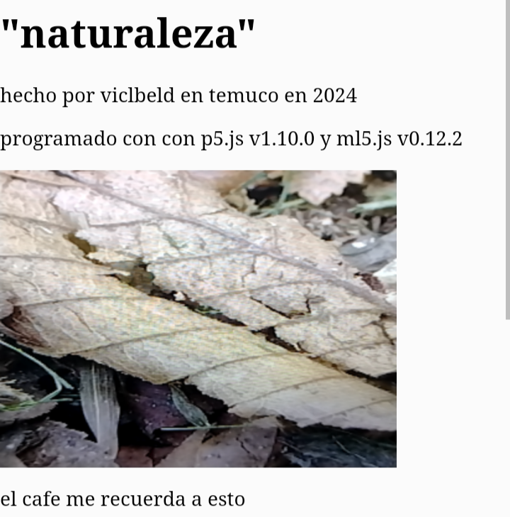

# clase-05

# "naturaleza"

## idea del proyecto

el principio de la idea era que dectectara cierta cantidad de colores que se disminuyo a 4 colores pero al ser colores similares u/o iguales, ya que solo serian de mas o poca saturacion  quedando en 2 tonos en especificos mas otros colores que abarca al resto de colores.


##  como funciona 

reconoce dos colores en especifico, los cuales serian:
- verde
- cafes

   u otros colores pero lo mas importantes son los mencionados anteriormente.
  ya que son colores que se puededen encontar en la mayoria de localidades. 

 aparecera una imagen cuando se muestre el cafe u/o verde, se mostrara en la pantalla.
 las fotos son  tomadas de distintos puntos del campus norte de la uct u otros lugares, en su mayoria son de la uct.

 el reconocimiento funciona con los colores verdes y cafes de la naturaleza.

 el formato que se utilizara para ocupar y reconocer los colores seran en celular con su camara trasera ya que es mas comodo a la hora de utilizarlo

 


## imagenes que muestran como funciona en la tablet 






## como funciona en el celular






## lo que se utilizo al crear el codigo

para crear el codigo se utilizo la siguiente pagina

<https://teachablemachine.withgoogle.com/>

 para entrenar se subieron 100 imagenes de cada categoria, en total serian 300, lo que ayudo a la programacion y que se le haga mas facil de indentificar los colores, tanto como los tonos escogidos y los otros colores.
 
 la pagina que se utilizo para hacer la pagina y editar el codigo es

<https://editor.p5js.org/>

la misma pagina tiene referencias que nos pueden ayudar a la hora de la programacion y edicion del codigo, nos muestra los codigos, como colocarlos tambien un ejemplo de como se verian.

<https://p5js.org/es/reference/>

## link para observar 

<https://editor.p5js.org/VicLBelD/full/Yftun9qiS>

## presentacion

![Pantallazo10]
![Pantallazo11]
![Pantallazo12]
![Pantallazo13]


## codigo camara trasera

```javascript
// Classifier Variable
let classifier;
// Model URL
let imageModelURL = "./my_model/";

// variables para prender la camara trasera de un celular 
let opciones = {
  audio: false,
  video: {
    facingMode: "environment",
  },
};


//  img.position(0, -10);

// video
let video;
// To store the classification
let label = "cargando...";

let imagenCafes;
let imagenVerdes;

let textoResultado = null;


let textoCafes = "el cafe me recuerda a esto";
let textoVerdes = "el verde me recuerda a esto";
let textoOtros = "";

// Load the model first
function preload() {
  classifier = ml5.imageClassifier(imageModelURL + "model.json");
  // imagenCafe = loadImage("cafes.jpg");
  // imagenVerde = loadImage("verdes.jpg");
}

function setup() {
  createCanvas(320, 240);
  // Create the video
  video = createCapture(opciones);
  video.size(320, 240);
  video.hide();
  
  imagenCafes = createImg('cafes.jpg', "cafes");
  
  imagenVerdes = createImg('verdes.jpg', "verdes");
  
  imagenCafes.hide();
  imagenVerdes.hide();
  
  textoResultado = document.getElementById("textoResultado");

  // Start classifying
  classifyVideo();
}

function draw() {
  background(0);
  // Draw the video
  image(video, 0, 0);

  // Draw the label
  // fill(255);
  // textSize(16);
  //textAlign(CENTER);
  // text(label, width / 2, height/10);
}

// Get a prediction for the current video frame
function classifyVideo() {
  classifier.classify(video, gotResult);
}

// When we get a result
function gotResult(error, results) {
  // If there is an error
  if (error) {
    console.error(error);
    return;
  }
  // The results are in an array ordered by confidence.
  // console.log(results[0]);
  label = results[0].label;
  
  if (label == "cafes") {  
    textoResultado.innerHTML = textoCafes;
  imagenCafes.show();
  imagenVerdes.hide();
  } else if (label == "verdes") {
    textoResultado.innerHTML = textoVerdes;
     imagenCafes.hide();
  imagenVerdes.show();
  } else {
  //  textoResultado.innerHTML = textoOtros;
  //    imagenCafes.hide();
  //imagenVerdes.hide();
  }
  
  // Classifiy again!
  classifyVideo();
}
```


