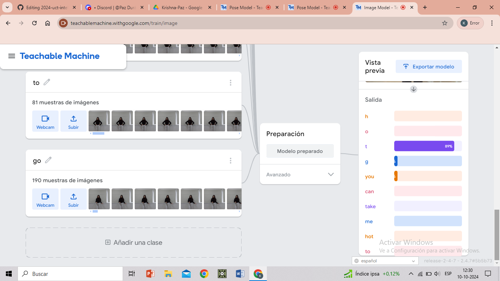
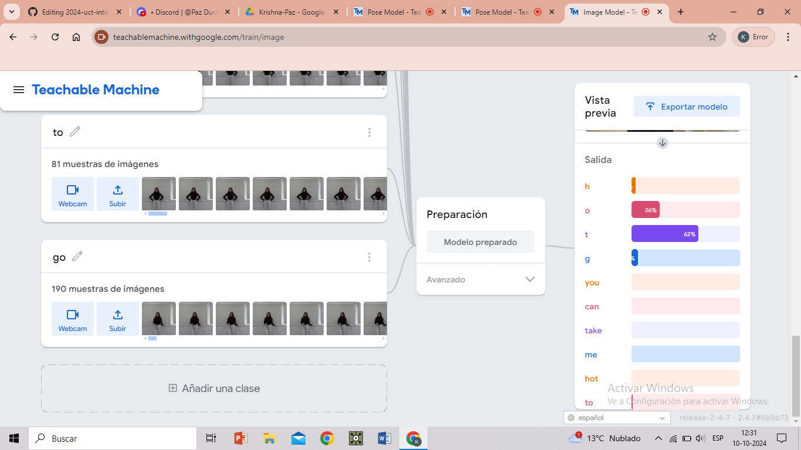
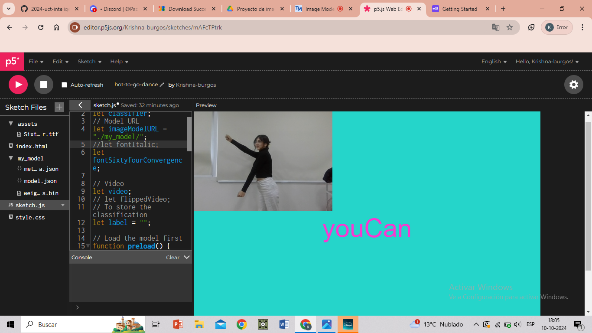
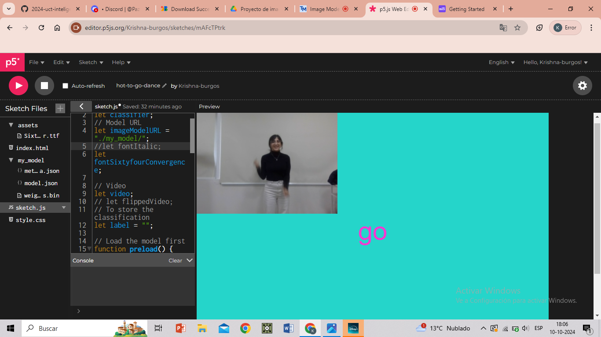
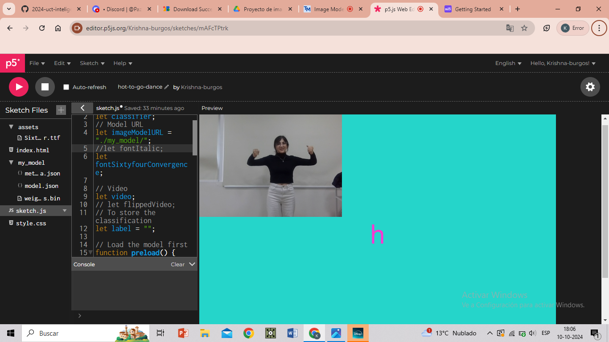
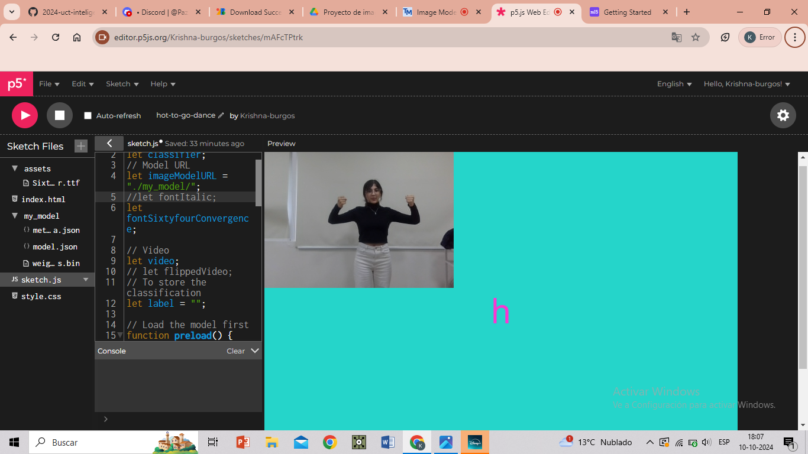

# clase-06
* 10 de octubre del 2024
## Pruebas de proyecto de imágen
* se realizaron pruebas del proyecto
* Hay dos pasos funcionan levemente ya que el computador capta como similares esos pasos
* Los demás pasos fi¿uncionan excelente
* A continuación se enviaran las pruebas fallidas

* link del proyecto
  
<https://editor.p5js.org/Krishna-burgos/full/mAFcTPtrk>

* link del proyecto mejorado

<https://editor.p5js.org/Krishna-burgos/full/HPYyqA3pd>
  

## proyecto final 
* A pesar de las pequeñas fallas funciona bien el proyecto y es algo que se puede celebrar, al no haber realizado nunca algo asi y en menos de una semana.

## Aprendizaje
* En éste curso de workshop prendí a programar y utilizar algoritmos, fue entretenido aprender a relizar estos proyectos y cada que habia algún  error aprendiamos y lo haciamos de nuevo, tambien debemos aprender a parar cuando algo no funciona
* Agradecidad de tener la oportunidad de poder crear un arte mas programático y algoritmico

# Imágenes de pruebas de reconocimiento pose/letra en Teachable Machine en modo 'proyecto de imagen'

# Capturas de pantalla de pruebas del algoritmo por medio de p5.js

