# clase-05
## Bitácora jueves en la mañana 10-10-2024

Comenzamos probando los samples creados el día miércoles,tratando de que los pasos de baile coincidan con la letra de la canción a la que pertenecen, sin embargo, notamos que los resultados son muy ambigüos. Esto debido a que las capturas de datos que le entregamos a Teachable Machine no lograban ser capturadas por el esqueleto, resultando en que el algoritmo no sea capaz de reconocer al 100% la mayoria de las poses y las confunde con otras, por lo tanto decidimos no continuar con estos samples y crear unos nuevos para el proyecto final.

A continuación presentamos capturas de imágenes del momento de prueba del algoritmo de poses:

## imágenes de pruebas del algoritmo con canción poker face de Lady Gaga (con fallas de lectura de las poses)

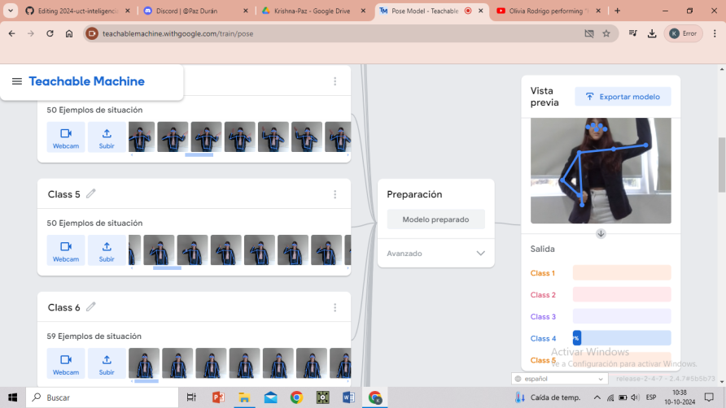

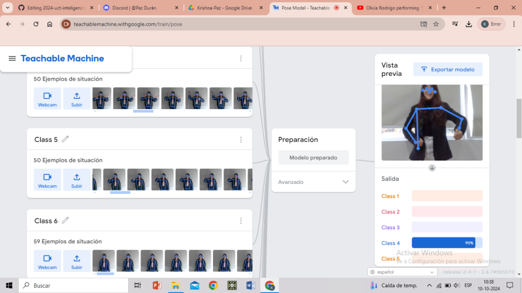

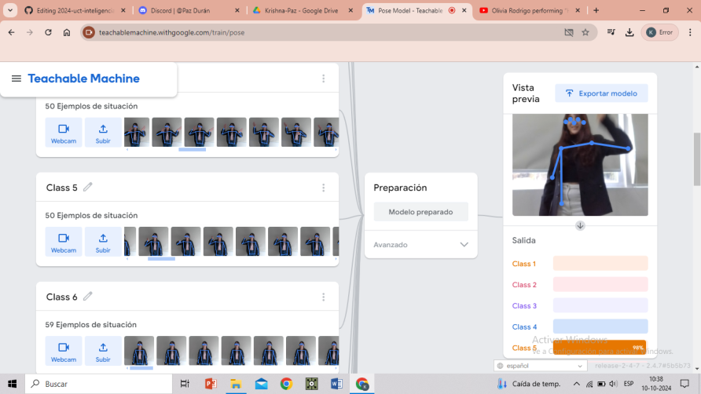

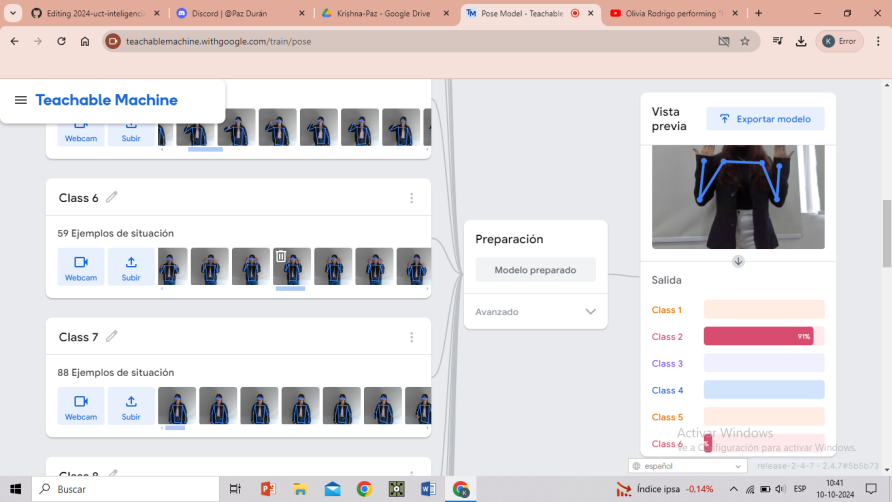

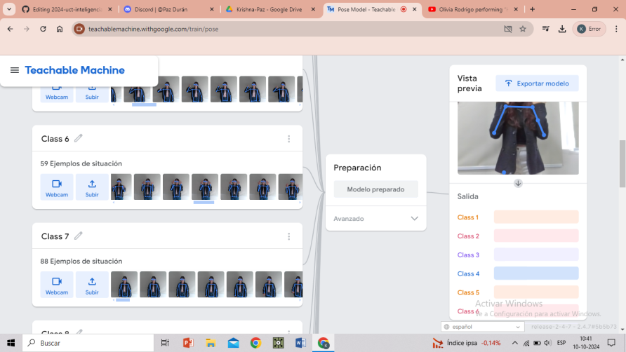

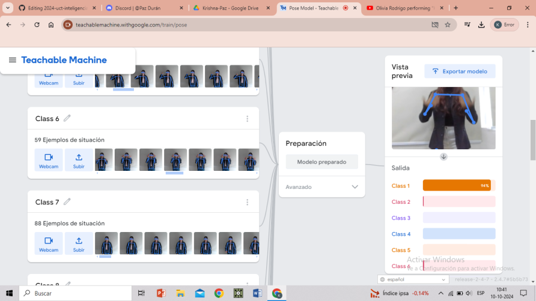

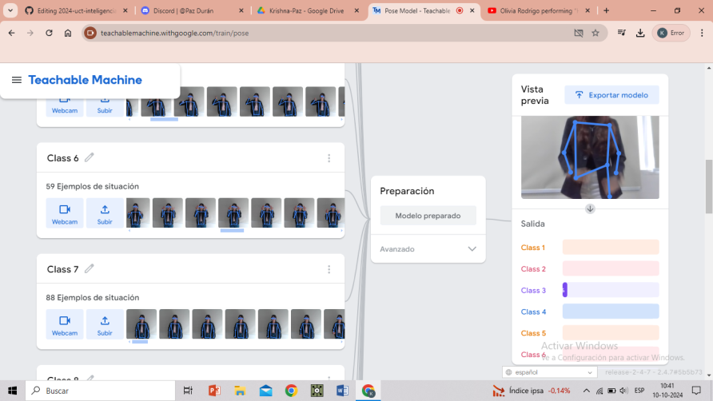

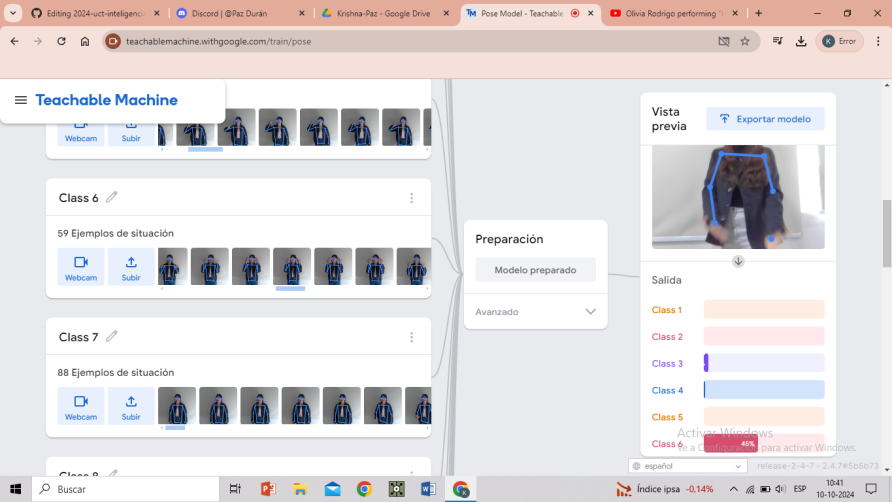

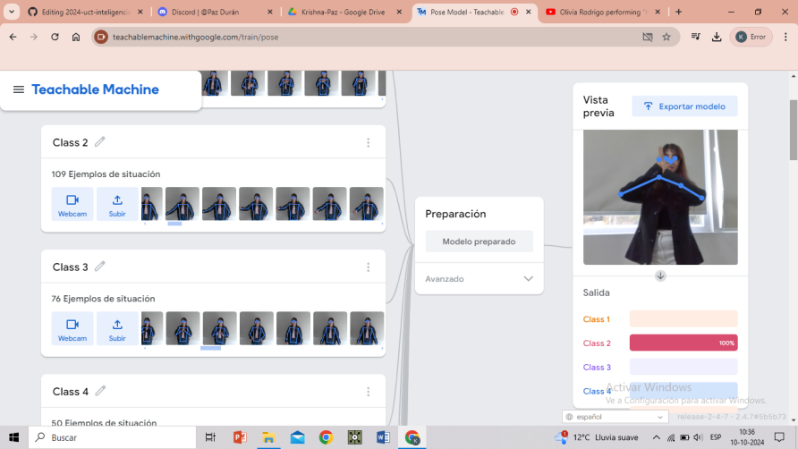

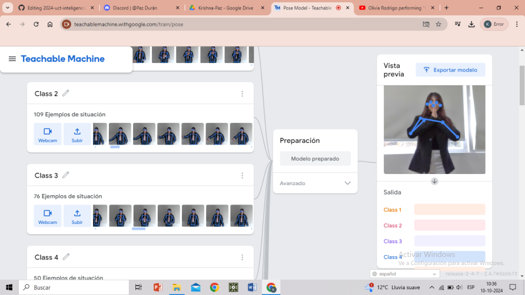

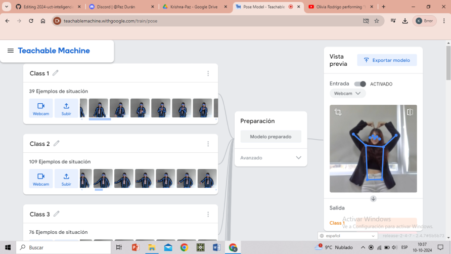

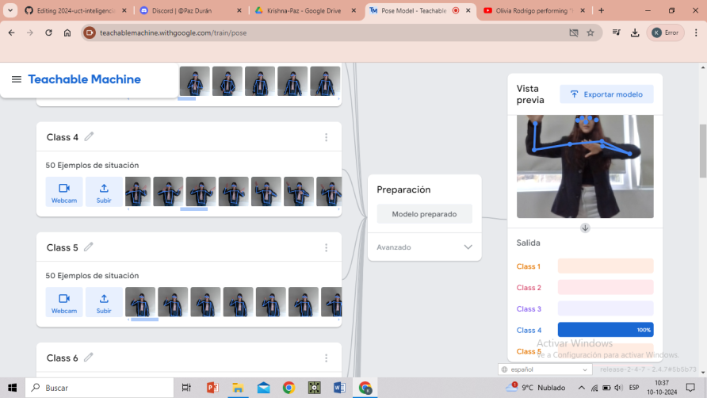

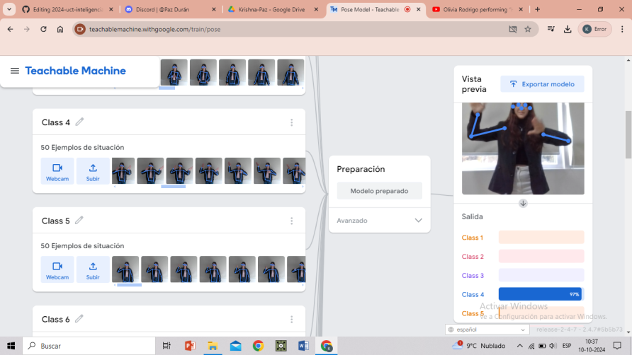

