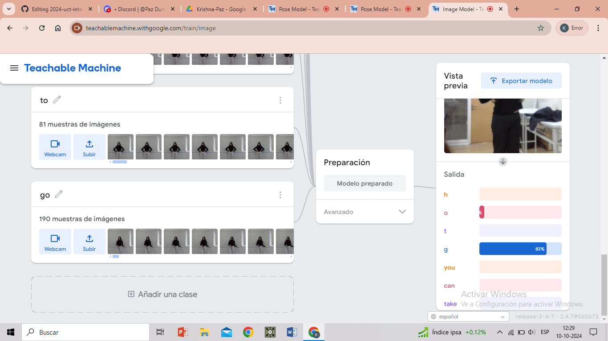
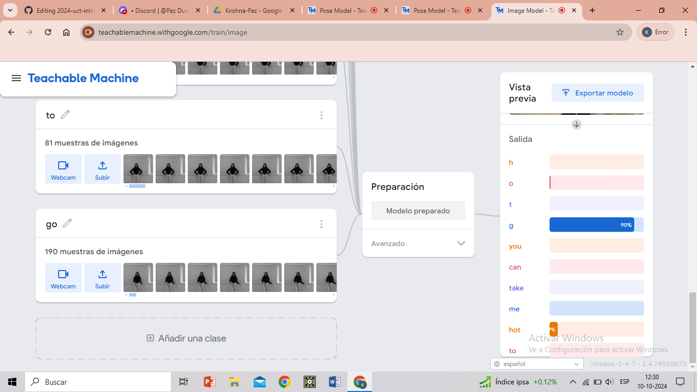

# clase-06
## bitácora del día jueves en la tarde 10-10-2024

* link proyecto

<https://editor.p5js.org/Krishna-burgos/full/mAFcTPtrk>

* link proyecto (mejorado)
  
<https://editor.p5js.org/Krishna-burgos/full/HPYyqA3pd>

#Proyecto final

Comenzamos a realizar las capturas de datos que utilizaremos a en proyecto final. El cual tiene como objetivo que pasos de baile seleccionados por nosotras con respecto a la letra del coro de la canción 'hot to go de Chappel Roan' sean leidos a traves de la webcam y mostrando en la pantalla la parte de la letra a la que pertenecen cada movimiento.

## Coro de la canción seleccionada para el proyecto: Hot to go-Chappel Roan

H-O-T-T-O-G-O

You can take me hot to go

H-O-T-T-O-G-O

You can take me hot to go

## Reflexiones

Debido a que el "proyecto de posturas" de Teachable Machine no es capaz de capturar todos los movimientos que deseabamos, hemos decidido utilizar el "proyecto de imagen" de este mismo, logrando que se puedan leer por la webcam 6/8 poses al 100%. Creemos que estos 2 pasos que no logran ser reconocidos en su totalidad y que por lo mismo son confundidos con otras palabras se deben a que en esas poses los brazos se encuentran frente al torso perjudicando que se puedan detectar ante la cámara.

A pesar de que los pasos de baile no puedan ser reconocidos a la perfección por el algoritmo, estamos satisfechas de que hemos sido capaces de adecuarnos a las fallas y encontrar un modo de capturar muestras que funcionan en su mayoria. 

Además hemos logrado programar los códigos entregados por Teachable Machine para que puedan ser leídos por p5.js y de este modo conseguir un algoritmo capaz de relacionar pasos de baile con la letra de una canción, todo esto siendo personas que no tenian experiencia en programación, algoritmos o inteligencias artificiales. Por tanto todos lo que hemos conseguido es resultado de cuatro días de aprendizaje y práctica.

A continuación se presentan imágenes que evidencian las fallas y logros de nuestro proyecto. Ejemplos:

## Imágenes de pruebas de reconocimiento pose/letra en Teachable Machine en modo 'proyecto de imagen'

## Capturas de pantalla de pruebas del algoritmo transpasado a p5.js

