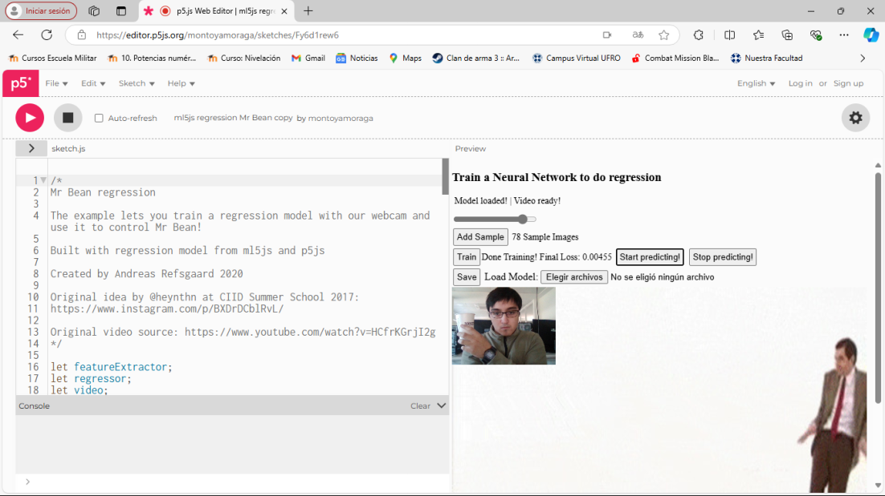
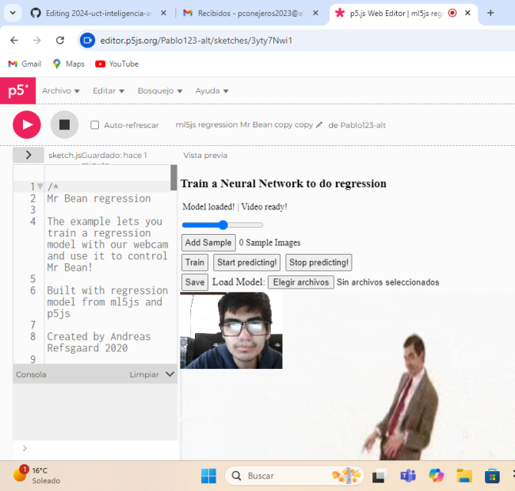

# clase-03

Jugamos con una cosa para mover un mr.bean en los ejemplos de p5js <https://editor.p5js.org/montoyamoraga/sketches/Fy6d1rew6> transformado a index.html
asunto: se tubo que cambiar el codigo para que trabajara en la version que necesitamos.
esa es la linea conflictiva: la arreglamos cambiandole la version a 0.12.2.
```html
  <script src="https://unpkg.com/ml5@0.12.2/dist/ml5.min.js"></script>
```
antes la linea tenia la version latest: que es la ultima version.
```html
<script src="https://unpkg.com/ml5@latest/dist/ml5.min.js" type="text/javascript"></script>
```
fotitos jugando con el asunto:



