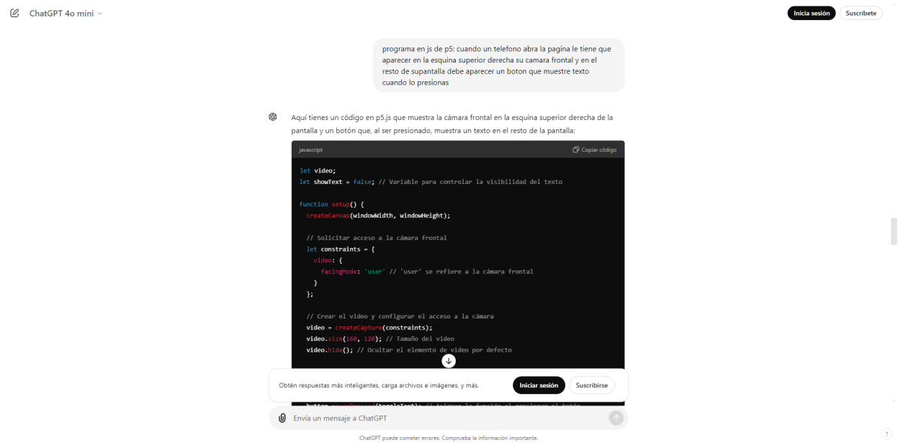
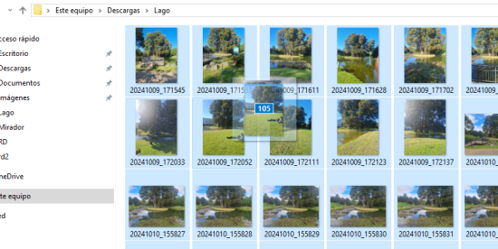

# clase-06

le pedimos a chat gpt que nos diera un codigo para que el programa reprodusca la camara trasera:

Nos confudimos con cual era la camara frontal:

Salimos a sacar fotos, para ocuparlas con teachable machine:

Recolectamos alrededor de 100 fotos para cada caso:

Ocupamos el codigo que nos arrojo teach hable sobre nuestra base de datos, este lo pusimos en el nuestro distinguiendo lo que estaba escrito en otro lenguaje de programacion y eliminando lineas de codio redundantes o que no aportaban nada:

